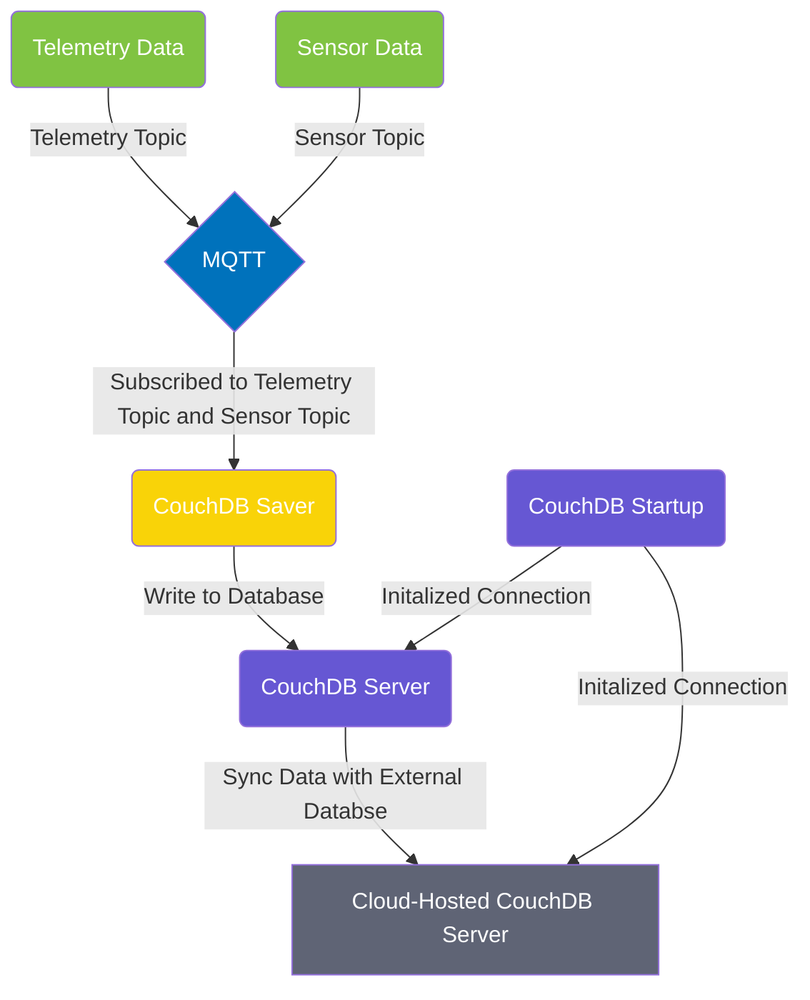

<a name="readme-top"></a>

[contributors-shield]: https://img.shields.io/github/contributors/IQTLabs/edgetech-couchdb-startup.svg?style=for-the-badge
[contributors-url]: https://github.com/IQTLabs/edgetech-couchdb-startup/graphs/contributors
[forks-shield]: https://img.shields.io/github/forks/IQTLabs/edgetech-couchdb-startup.svg?style=for-the-badge
[forks-url]: https://github.com/IQTLabs/edgetech-couchdb-startup/network/members
[stars-shield]: https://img.shields.io/github/stars/IQTLabs/edgetech-couchdb-startup.svg?style=for-the-badge
[stars-url]: https://github.com/IQTLabs/edgetech-couchdb-startup/stargazers
[issues-shield]: https://img.shields.io/github/issues/IQTLabs/edgetech-couchdb-startup.svg?style=for-the-badge
[issues-url]: https://github.com/IQTLabs/edgetech-couchdb-startup/issues
[license-shield]: https://img.shields.io/github/license/IQTLabs/edgetech-couchdb-startup.svg?style=for-the-badge
[license-url]: https://github.com/IQTLabs/edgetech-couchdb-startup/blob/master/LICENSE.txt
[product-screenshot]: images/screenshot.png

[Python]: https://img.shields.io/badge/python-000000?style=for-the-badge&logo=python
[Python-url]: https://www.python.org
[Poetry]: https://img.shields.io/badge/poetry-20232A?style=for-the-badge&logo=poetry
[Poetry-url]: https://python-poetry.org
[Docker]: https://img.shields.io/badge/docker-35495E?style=for-the-badge&logo=docker
[Docker-url]: https://www.docker.com

[![Contributors][contributors-shield]][contributors-url]
[![Forks][forks-shield]][forks-url]
[![Stargazers][stars-shield]][stars-url]
[![Issues][issues-shield]][issues-url]
[![MIT License][license-shield]][license-url]

<br />
<div align="center">
  <a href="https://iqtlabs.org/">
    
  </a>

<h1 align="center">EdgeTech-CouchDB-Startup</h1>

  <p align="center">
    This repo builds upon the <a href="https://www.apache.org">Apache Foundation's</a> <a href="https://couchdb.apache.org">CouchDB</a> database to inflate and initialize a CouchDB database and setup a connection with the external, cloud hosted database to sync with. All of this functionality is wrapped in Docker containers (natively through the <a href="https://hub.docker.com/_/couchdb">CouchDB Docker Image</a> on Docker Hub) for cross-platform compatibility. 
    <br/>
    <br/>
    <a href="https://github.com/IQTLabs/edgetech-couchdb-startup/pulls">Make Contribution</a>
    ·
    <a href="https://github.com/IQTLabs/edgetech-couchdb-startup/issues">Report Bug</a>
    ·
    <a href="https://github.com/IQTLabs/edgetech-couchdb-startup/issues">Request Feature</a>
  </p>
</div>

### Built With

[![Python][Python]][Python-url]
[![Poetry][Poetry]][Poetry-url]
[![Docker][Docker]][Docker-url]

## Getting Started

To run this repo, simply run:

```
docker-compose up
```

The filesaver is containerized and dependencies are managed using [poetry]("https://python-poetry.org"). 

### Prerequisites

Running this repo requires that you have [Docker](https://www.docker.com) installed. 

## Usage

You can find an example of the startup workflow in this repository's `docker-compose.yml` which starts up a CouchDB server and a sync initialization container. Additionally, some editing of relevant environment variables will be required based upon your system's configuration of topics to subscribe to and CouchDB configuration. Examples of these environment variables can be found in this repository's `.env` file. 

Copying the CouchDB `docker-compose` statements into a master `docker-compose.yml` and  `.env` files with your entire system of containers is the preferred workflow. Find an application architecture diagram example of how the usage of this module was envisioned below.



## Roadmap

- TBA

See the [open issues](https://github.com/github_username/repo_name/issues) for a full list of proposed features (and known issues).

## Contributing

1. Fork the Project
2. Create your Feature Branch (`git checkout -b dev`)
3. Commit your Changes (`git commit -m 'adding some feature'`)
4. Push to the Branch (`git push origin dev`)
5. Open a Pull Request

See `CONTRIBUTING.md` for more information.

## License

Distributed under the [Apache 2.0](https://github.com/IQTLabs/edgetech-couchdb-startup/blob/main/LICENSE). See `LICENSE.txt` for more information.

## Contact IQTLabs

  - Twitter: [@iqtlabs](https://twitter.com/iqtlabs)
  - Email: info@iqtlabs.org

See our other projects: [https://github.com/IQTLabs/](https://github.com/IQTLabs/)

<p align="right">(<a href="#readme-top">back to top</a>)</p>


